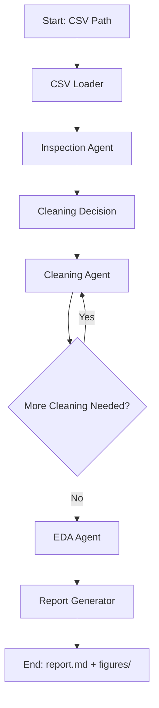
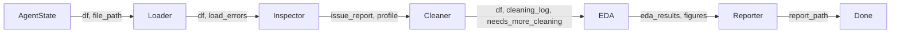

# Design Document: Autonomous Data Cleaning & EDA Agent

## Overview

This system implements a multi-step autonomous agent pipeline using LangGraph that takes a messy CSV file as input and produces a cleaned dataset, exploratory analysis, and a Markdown summary report. The workflow is modeled as a directed graph with nodes for inspection, cleaning (with conditional looping), EDA, and report generation. Each node is an agent backed by a tool-calling LLM that reasons about the data state and invokes Pandas-based tools.

The architecture prioritizes:
- Structured multi-step control via LangGraph state graph
- Clear separation between agent reasoning (LLM) and data operations (tools)
- Graceful degradation on errors at any stage
- Full traceability of cleaning actions and agent decisions

## Architecture

The system uses a LangGraph `StateGraph` with a shared state object passed between nodes. Each node is an agent that receives the current state, invokes tools via the LLM, and returns an updated state.



### State Flow

All agents share a single `AgentState` TypedDict that accumulates results as the workflow progresses. Each node reads from and writes to specific keys in this state.



## Components and Interfaces

### 1. CSV Loader (`csv_loader.py`)

Responsible for reading CSV files with automatic encoding and delimiter detection.

```python
def load_csv(file_path: str) -> dict:
    """
    Load a CSV file with automatic encoding/delimiter detection.
    
    Args:
        file_path: Path to the CSV file.
    
    Returns:
        dict with keys:
            - "df": pd.DataFrame (the loaded data)
            - "error": Optional[str] (error message if loading failed)
    """
```

Implementation approach:
- Use `chardet` or `charset_normalizer` to detect encoding
- Use `csv.Sniffer` to detect delimiter
- Fall back to common defaults (utf-8, comma) on detection failure
- Validate that the resulting DataFrame has at least one data row

### 2. Inspection Tools (`tools/inspection.py`)

Tools exposed to the Inspection Agent via LangChain tool decorators.

```python
@tool
def get_df_info(state: dict) -> str:
    """Return shape, dtypes, head(10), tail(10), sample(5) as formatted string."""

@tool
def detect_issues(state: dict) -> dict:
    """
    Detect data quality issues.
    
    Returns dict with:
        - missing_pct: dict[str, float]  # column -> % missing
        - duplicate_count: int
        - outliers: dict[str, list]  # column -> outlier indices (IQR)
        - inconsistent_types: list[str]  # columns with mixed types
        - high_cardinality: list[str]  # categorical cols with high unique count
        - zero_variance: list[str]  # columns with single unique value
    """
```

### 3. Cleaning Tools (`tools/cleaning.py`)

Tools exposed to the Cleaning Agent. Each tool operates on the DataFrame in state and returns the modified DataFrame plus a log entry.

```python
@tool
def drop_duplicates(df: pd.DataFrame) -> tuple[pd.DataFrame, str]:
    """Remove duplicate rows. Returns (cleaned_df, log_entry)."""

@tool
def fill_missing(df: pd.DataFrame, column: str, strategy: str) -> tuple[pd.DataFrame, str]:
    """Fill missing values. strategy: mean|median|mode|ffill|knn."""

@tool
def convert_dtypes(df: pd.DataFrame, column: str, target_type: str) -> tuple[pd.DataFrame, str]:
    """Convert column dtype with coercion."""

@tool
def remove_outliers(df: pd.DataFrame, column: str, method: str) -> tuple[pd.DataFrame, str]:
    """Remove/cap outliers. method: iqr|zscore."""

@tool
def normalize_columns(df: pd.DataFrame) -> tuple[pd.DataFrame, str]:
    """Strip whitespace and lowercase all column names."""

@tool
def strip_string_values(df: pd.DataFrame) -> tuple[pd.DataFrame, str]:
    """Strip leading/trailing whitespace from all string columns."""

@tool
def drop_useless_columns(df: pd.DataFrame, threshold: float = 0.9) -> tuple[pd.DataFrame, str]:
    """Drop columns with >threshold missing or zero variance."""
```

### 4. EDA Tools (`tools/eda.py`)

Tools exposed to the EDA Agent for analysis and visualization.

```python
@tool
def describe_numeric(df: pd.DataFrame) -> str:
    """Return descriptive statistics for numeric columns."""

@tool
def describe_categorical(df: pd.DataFrame, top_n: int = 10) -> str:
    """Return value counts for top N categories per categorical column."""

@tool
def compute_correlation(df: pd.DataFrame) -> str:
    """Compute and return correlation matrix for numeric columns."""

@tool
def generate_plots(df: pd.DataFrame, output_dir: str) -> list[str]:
    """Generate histograms, box plots, heatmap. Returns list of saved file paths."""
```

### 5. Report Generator (`report_generator.py`)

Compiles all results into a Markdown report.

```python
def generate_report(
    original_shape: tuple[int, int],
    cleaned_shape: tuple[int, int],
    issue_report: dict,
    cleaning_log: list[str],
    eda_results: dict,
    insights: list[str],
    figure_paths: list[str],
    output_dir: str
) -> str:
    """
    Generate a Markdown report and save to output_dir/report.md.
    Returns the path to the saved report.
    """
```

### 6. Agent Orchestrator (`graph.py`)

The LangGraph state graph definition and node implementations.

```python
class AgentState(TypedDict):
    file_path: str
    df: Optional[pd.DataFrame]
    profile: Optional[str]
    issue_report: Optional[dict]
    cleaning_log: list[str]
    cleaning_iteration: int
    max_cleaning_iterations: int
    needs_more_cleaning: bool
    eda_results: Optional[dict]
    insights: list[str]
    figure_paths: list[str]
    report_path: Optional[str]
    errors: list[str]
    reasoning_log: list[dict]  # {timestamp, agent, reasoning}

def build_graph(llm) -> StateGraph:
    """
    Build and return the LangGraph workflow.
    
    Nodes: load_csv_node, inspect_node, clean_decision_node, 
           clean_node, eda_node, report_node
    Edges: linear with conditional loop on clean_node
    """
```

### 7. LLM Configuration (`llm_config.py`)

```python
def get_llm(provider: str = "openai", model: str = None, **kwargs) -> BaseChatModel:
    """
    Initialize and return a tool-calling capable LLM.
    
    Args:
        provider: "openai" | "anthropic" | "groq"
        model: Model name override
    
    Returns:
        Configured LangChain chat model
    """
```

## Data Models

### AgentState

The central state object shared across all graph nodes:

```python
class AgentState(TypedDict):
    # Input
    file_path: str
    
    # Data
    df: Optional[pd.DataFrame]
    original_shape: Optional[tuple[int, int]]
    
    # Inspection
    profile: Optional[str]
    issue_report: Optional[dict]
    
    # Cleaning
    cleaning_log: list[str]
    cleaning_iteration: int
    max_cleaning_iterations: int  # default: 3
    needs_more_cleaning: bool
    
    # EDA
    eda_results: Optional[dict]
    insights: list[str]
    figure_paths: list[str]
    
    # Output
    report_path: Optional[str]
    
    # Traceability
    errors: list[str]
    reasoning_log: list[dict]
```

### IssueReport

```python
@dataclass
class IssueReport:
    missing_pct: dict[str, float]       # column_name -> percentage missing
    duplicate_count: int                 # number of duplicate rows
    outliers: dict[str, list[int]]       # column_name -> list of outlier row indices
    inconsistent_types: list[str]        # column names with mixed types
    high_cardinality: list[str]          # categorical columns with high unique ratio
    zero_variance: list[str]             # columns with single unique value
    severity_ranking: list[dict]         # [{issue, severity, priority}] from LLM
```

### CleaningLogEntry

```python
@dataclass
class CleaningLogEntry:
    timestamp: str
    operation: str          # e.g., "drop_duplicates", "fill_missing"
    columns_affected: list[str]
    parameters: dict        # e.g., {"strategy": "median"}
    rows_before: int
    rows_after: int
    description: str        # human-readable description
```

### EDAResults

```python
@dataclass
class EDAResults:
    numeric_stats: str          # describe() output
    categorical_stats: dict     # column -> value_counts
    correlation_matrix: Optional[str]  # correlation matrix as string
    figure_paths: list[str]     # paths to saved figures
    insights: list[str]         # 3-5 LLM-generated insights
```


## Correctness Properties

*A property is a characteristic or behavior that should hold true across all valid executions of a system — essentially, a formal statement about what the system should do. Properties serve as the bridge between human-readable specifications and machine-verifiable correctness guarantees.*

### Property 1: CSV Load Round-Trip

*For any* valid tabular data written to a CSV file with any supported encoding (utf-8, latin-1, cp1252) and any supported delimiter (comma, tab, semicolon, pipe), loading the file via CSV_Loader should produce a DataFrame whose values match the original data.

**Validates: Requirements 1.1, 1.2, 1.3**

### Property 2: Missing Value Detection Accuracy

*For any* DataFrame with a known pattern of missing values injected at controlled positions, the Inspection_Agent's `detect_issues` function should report missing percentages per column that match the actual missing percentages (within floating-point tolerance).

**Validates: Requirements 2.2**

### Property 3: Duplicate Detection Accuracy

*For any* DataFrame with a known number of duplicate rows inserted, the Inspection_Agent's `detect_issues` function should report a duplicate count equal to the actual number of duplicate rows.

**Validates: Requirements 2.3**

### Property 4: Outlier Detection via IQR

*For any* numeric column, the Inspection_Agent should flag exactly those values that fall outside the range [Q1 - 1.5 * IQR, Q3 + 1.5 * IQR] as outliers.

**Validates: Requirements 2.4**

### Property 5: Inconsistent Type Detection

*For any* DataFrame column containing a mix of numeric and non-numeric string values, the Inspection_Agent should include that column in the inconsistent_types list.

**Validates: Requirements 2.5**

### Property 6: Zero-Variance and High-Cardinality Detection

*For any* DataFrame, columns with exactly one unique value should appear in the zero_variance list, and categorical columns whose unique-value ratio exceeds the defined threshold should appear in the high_cardinality list.

**Validates: Requirements 2.6**

### Property 7: Profile Completeness

*For any* DataFrame with at least one row, the Inspection_Agent's profile output should contain the shape, data types for every column, the first 10 rows, the last 10 rows, and a sample of up to 5 rows.

**Validates: Requirements 2.1**

### Property 8: Duplicate Removal Invariant

*For any* DataFrame, after applying `drop_duplicates`, the resulting DataFrame should contain zero duplicate rows.

**Validates: Requirements 3.1**

### Property 9: Missing Value Fill Invariant

*For any* DataFrame column with missing values, after applying `fill_missing` with any valid strategy (mean, median, mode, ffill), the resulting column should contain zero missing values.

**Validates: Requirements 3.2**

### Property 10: Type Conversion Consistency

*For any* DataFrame column that undergoes `convert_dtypes`, the resulting column should have a single consistent dtype (no mixed types).

**Validates: Requirements 3.3**

### Property 11: Outlier Removal Invariant (IQR)

*For any* numeric column, after applying `remove_outliers` with the IQR method, no remaining values should fall outside the range [Q1 - 1.5 * IQR, Q3 + 1.5 * IQR] computed on the original data.

**Validates: Requirements 3.4**

### Property 12: String Normalization Invariant

*For any* DataFrame, after applying `normalize_columns` and `strip_string_values`: (a) all column names should be lowercase with no leading/trailing whitespace, and (b) no string cell value should have leading or trailing whitespace.

**Validates: Requirements 3.5, 3.7**

### Property 13: Useless Column Removal Invariant

*For any* DataFrame, after applying `drop_useless_columns` with a 90% threshold, no remaining column should have more than 90% missing values and no remaining column should have zero variance.

**Validates: Requirements 3.6**

### Property 14: Cleaning Log Completeness

*For any* cleaning operation applied to any DataFrame, the resulting log entry should contain the operation name, list of affected columns, parameters used, and row counts before and after the operation.

**Validates: Requirements 3.8, 8.1**

### Property 15: Numeric Descriptive Statistics Coverage

*For any* DataFrame with at least one numeric column, the EDA_Agent's `describe_numeric` output should contain statistics for every numeric column in the DataFrame.

**Validates: Requirements 4.1**

### Property 16: Categorical Value Counts Coverage

*For any* DataFrame with at least one categorical column, the EDA_Agent's `describe_categorical` output should contain value counts for every categorical column.

**Validates: Requirements 4.2**

### Property 17: Correlation Matrix Invariants

*For any* DataFrame with two or more numeric columns, the computed correlation matrix should be symmetric and have values of 1.0 on the diagonal.

**Validates: Requirements 4.3**

### Property 18: Insight Count Constraint

*For any* completed EDA run, the number of generated insights should be between 3 and 5 inclusive.

**Validates: Requirements 4.5**

### Property 19: Report Section Completeness

*For any* set of valid inputs (original shape, cleaned shape, issue report, cleaning log, EDA results, insights, figure paths), the generated Markdown report should contain sections for dataset shape, issues found, fixes applied, key statistics, and insights.

**Validates: Requirements 5.1**

### Property 20: Report Figure References

*For any* report generated with a non-empty list of figure paths, each figure path should appear in the Markdown report as a relative path reference.

**Validates: Requirements 5.4**

### Property 21: Error Resilience

*For any* workflow stage that raises an exception, the Agent_Orchestrator should catch the error, append it to the errors list, and continue to the next stage without crashing.

**Validates: Requirements 6.3**

### Property 22: Reasoning Log Traceability

*For any* completed workflow run, each entry in the reasoning log should contain a timestamp, the agent name, and the reasoning text.

**Validates: Requirements 6.4, 8.3**

### Property 23: Cleaning Log in Report

*For any* completed workflow, the final report should contain every entry from the cleaning log.

**Validates: Requirements 8.2**

## Error Handling

### CSV Loading Errors

- **File not found / unreadable**: Return error dict with descriptive message. Do not raise exception.
- **Encoding detection failure**: Fall back to utf-8, then latin-1. If all fail, return error.
- **Delimiter detection failure**: Fall back to comma. If parsing produces a single-column DataFrame with many rows, retry with common delimiters.
- **Empty file / header-only**: Return error indicating no data rows.

### Agent Stage Errors

- Each graph node wraps its logic in a try/except block.
- On exception: log the error to `state["errors"]`, set degraded output for that stage, and return state so the graph continues.
- The Cleaning Agent has a max iteration limit (default: 3) to prevent infinite loops.

### LLM Errors

- Invalid tool calls: Catch `ToolException`, log it, and allow the LLM to retry (up to 3 retries per tool call).
- LLM timeout / rate limit: Use exponential backoff with 3 retries.
- Malformed LLM output: Parse defensively, fall back to default strategies (e.g., median for fill_missing).

### Data Operation Errors

- Type conversion failures: Use `errors='coerce'` to convert unparseable values to NaN rather than raising.
- Division by zero in statistics: Guard with checks before computing (e.g., skip correlation for constant columns).
- Plot generation failures: Log error, skip the plot, continue with remaining plots.

## Testing Strategy

### Testing Framework

- **Unit tests**: `pytest`
- **Property-based tests**: `hypothesis` (Python PBT library)
- **Minimum iterations**: 100 examples per property test

### Unit Tests

Unit tests cover specific examples, edge cases, and error conditions:

- CSV loading with specific known files (empty, header-only, various encodings)
- Individual cleaning tools with known input/output pairs
- Report generation with fixed inputs
- LLM configuration for each provider
- Graph node transitions (mock LLM)

### Property-Based Tests

Each correctness property from the design is implemented as a single Hypothesis test. Tests are tagged with:

```python
# Feature: data-cleaning-eda-agent, Property N: <property_text>
```

Property tests focus on:
- CSV round-trip loading (Property 1)
- Issue detection accuracy (Properties 2–7)
- Cleaning operation invariants (Properties 8–14)
- EDA output correctness (Properties 15–18)
- Report generation completeness (Properties 19–20, 23)
- Orchestrator resilience and traceability (Properties 21–22)

### Test Organization

```
tests/
├── test_csv_loader.py          # Unit + Property tests for CSV loading
├── test_inspection_tools.py    # Unit + Property tests for issue detection
├── test_cleaning_tools.py      # Unit + Property tests for cleaning operations
├── test_eda_tools.py           # Unit + Property tests for EDA
├── test_report_generator.py    # Unit + Property tests for report generation
├── test_graph.py               # Integration tests for orchestrator
└── conftest.py                 # Shared fixtures and Hypothesis strategies
```

### Hypothesis Strategies

Custom strategies for generating test DataFrames:

```python
@st.composite
def messy_dataframes(draw):
    """Generate DataFrames with controlled messiness (missing values, duplicates, mixed types, outliers)."""
    ...

@st.composite  
def csv_file_params(draw):
    """Generate CSV file parameters (encoding, delimiter, data)."""
    ...
```
