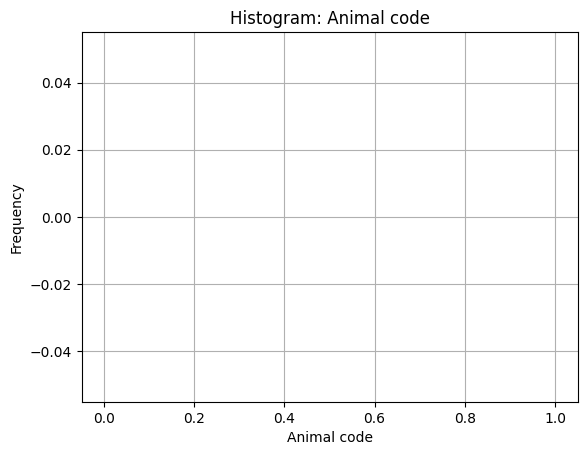
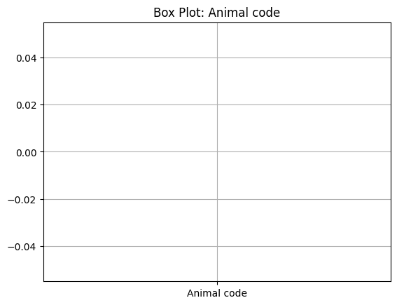
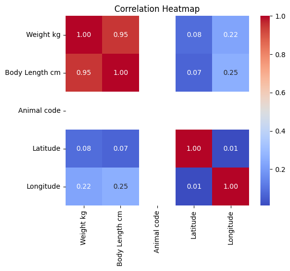

# Data Cleaning & EDA Report

## Dataset Overview

- **Original shape**: 1011 rows × 11 columns
- **Cleaned shape**: 1011 rows × 11 columns
- **Rows removed**: 0
- **Columns removed**: 0

## Issues Found

### Missing Values

| Column | Missing % |
|--------|-----------|
| Animal type | 2.0% |
| Country | 1.2% |
| Weight kg | 2.7% |
| Body Length cm | 2.7% |
| Gender | 1.9% |
| Animal code | 100.0% |
| Latitude | 9.7% |
| Longitude | 9.7% |
| Animal name | 94.9% |
| Observation date | 0.0% |
| Data compiled by | 0.0% |

### Duplicate Rows

- **167** duplicate rows detected

### Outliers

| Column | Outlier Count |
|--------|---------------|
| Weight kg | 134 |
| Body Length cm | 147 |
| Latitude | 6 |
| Longitude | 4 |

### Zero Variance Columns

- Animal code

## Cleaning Actions

No cleaning actions were performed.


## Key Statistics

### Numeric Statistics

```
         Weight kg  Body Length cm  Animal code    Latitude   Longitude
count   984.000000      984.000000          0.0  913.000000  913.000000
mean     39.745503       39.107724          NaN   49.393369   18.203280
std     156.290076       58.628601          NaN    7.168900    3.899601
min      -0.252000      -19.000000          NaN  -78.582973   11.074008
25%       0.293000       19.000000          NaN   48.186913   14.384559
50%       0.331500       21.000000          NaN   49.560723   18.944015
75%       0.800000       23.000000          NaN   52.212433   21.033243
max    1100.000000      350.000000          NaN   52.853843   34.896734
```

### Categorical Statistics

```
Column: Animal type
Animal type
red squirrel       543
hedgehog           274
lynx                61
European bison      49
red squirrell       22
red squirel         14
lynx?               10
European bison™      6
European bisson      4
European buster      4

Column: Country
Country
Poland            291
Germany           176
Slovakia          151
Hungary           146
Czech Republic    103
Austria            74
PL                 15
HU                 11
Hungry             10
CZ                  5

Column: Gender
Gender
male              499
female            488
not determined      5

Column: Animal name
Animal name
Bob Bobson    18
Basia         10
Lola           9
Lolek          4
Zuzia          4
Sissi          2
Puchatek       2
Szefu          1
Klucha         1
Bibi           1

Column: Observation date
Observation date
01.03.2024    61
02.03.2024    47
06.04.2024    45
04.03.2024    43
02.04.2024    41
21.03.2024    28
24.03.2024    28
07.03.2024    25
11.03.2024    23
08.04.2024    20

Column: Data compiled by
Data compiled by
Anne Anthony     473
Bob Bobson       259
John Johnson     249
James Johnson     30
```

### Correlation Matrix

```
                Weight kg  Body Length cm  Animal code  Latitude  Longitude
Weight kg        1.000000        0.946319          NaN  0.084595   0.224579
Body Length cm   0.946319        1.000000          NaN  0.065909   0.253616
Animal code           NaN             NaN          NaN       NaN        NaN
Latitude         0.084595        0.065909          NaN  1.000000   0.009833
Longitude        0.224579        0.253616          NaN  0.009833   1.000000
```

## Insights

1. [{'type': 'text', 'text': '<thinking> To analyze the cleaned dataset and provide insights, I will first need to gather descriptive statistics for numeric columns, value counts for categorical columns, and the correlation matrix. These will help identify trends, anomalies, and provide a basis for recommendations. </thinking>\n'}, {'type': 'tool_use', 'name': 'eda_numeric_stats', 'input': {}, 'id': 'tooluse_hLJpLRz33U03PODXW3JzvX'}, {'type': 'tool_use', 'name': 'eda_categorical_stats', 'input': {}, 'id': 'tooluse_QyO1wQ3tGiEeDPb8ouayFN'}, {'type': 'tool_use', 'name': 'eda_correlation', 'input': {}, 'id': 'tooluse_QB0SVln4P1aIhyzfo9XtAT'}]

## Figures









